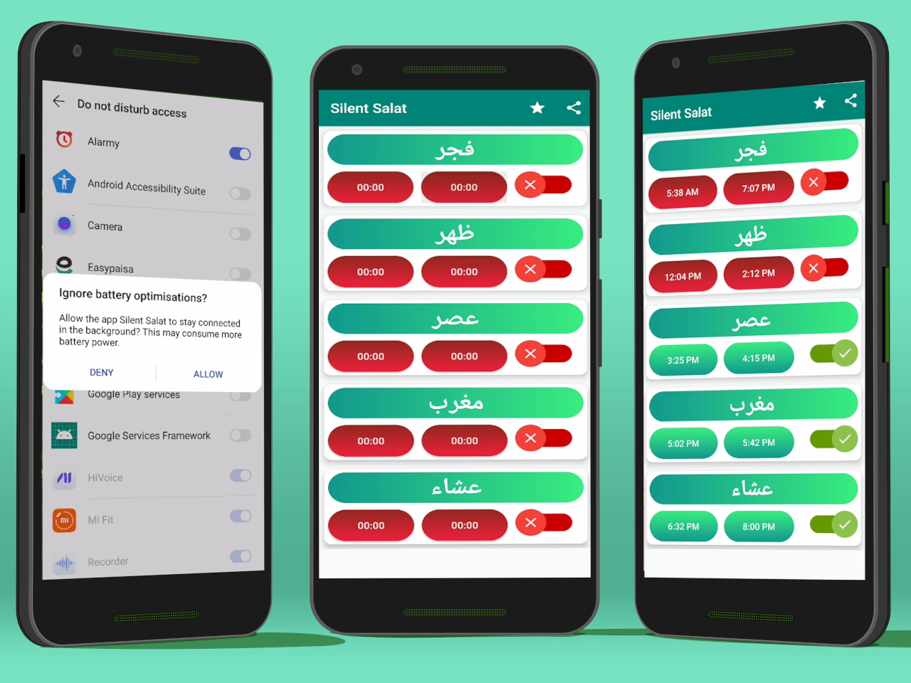

# SilentSalah

## Road map
1) Migrate to Kotlin
2) Fix issues 
   1) Does not show notification
   2) Does not change Ringer status
   3) Update date picker and business logic
3) Update UI
4) Add Salah time automation based on location & date/time
5) Notification Management,
6) Remove Service in favour of WorkManager
7) Separation of concerns

## Working
An application which turns the Phone state to Silent when Salah time reaches and turn the phone state back to normal when Salah time ends.

## Instructions:
1) After Installing the App please Allow the Permissions.

    a)- REQUEST_IGNORE_BATTERY_OPTIMIZATIONS: [Documentation](https://developer.android.com/training/monitoring-device-state/doze-standby "More About Battery Optimization Request").
    
    b)- DnD (Do not Disturb access Permission): [Reference](https://developer.android.com/reference/android/Manifest.permission#ACCESS_NOTIFICATION_POLICY).
  

## Libraries Used
a) Toggle Buttons: [Link to Library](https://github.com/RiccardoMoro/RMSwitch "Link to the Github page")

## NOTE
This Application is merely Developed with the intention of Sadqa-e-Jaariyah, So please feel free to contribute and report bugs :)

This code is licensed under The **GPLv3**.

